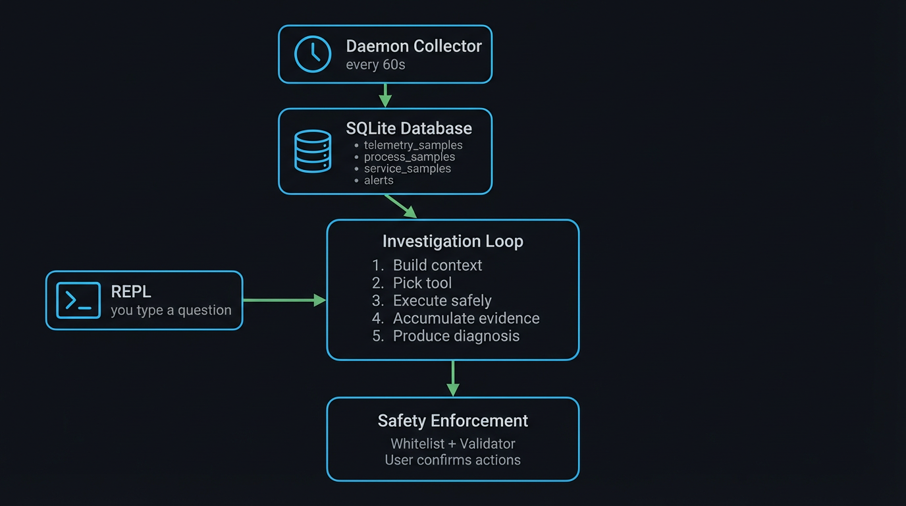

<p align="center">
  
</p>

<h1 align="center">KernelIQ</h1>
<p align="center"><b>AI-Powered Linux System Diagnosis</b></p>

KernelIQ is an open-source Linux troubleshooting agent that explains **why your system is slow, unstable, or behaving strangely.** It continuously collects local telemetry, stores it in SQLite, and uses an LLM-driven investigation loop to turn system state into a clear diagnosis and an actionable next step.

> **Not a dashboard. Not a log viewer. An investigator.**

---

## Why KernelIQ?

Most observability tools show metrics. KernelIQ answers questions.

Instead of manually inspecting logs, process tables, and system stats, KernelIQ investigates across all of them and returns a structured result — what is wrong, what evidence supports it, what action to take, and how confident it is.

**Example questions you can ask:**

- Why is my system slow?
- Which process caused the spike?
- Are any services failing?
- What changed a few minutes ago?
- Was there suspicious activity recently?

---

## Features

- Background telemetry daemon with 60-second sampling
- Local SQLite-backed system history
- Natural-language investigation through a terminal REPL
- Read-only command execution during diagnosis
- Structured outputs: **Observation → Evidence → Action → Confidence**
- Explicit confirmation before running potentially destructive actions
- Support for both **local** (Ollama) and **cloud** (OpenAI, Claude, DeepSeek, Gemini) model backends

---

## Demo

[▶ Watch demo](docs/images/demo.mp4)

---

## Quick Start

### One-command install

```bash
curl -fsSL https://raw.githubusercontent.com/abhinayshrestha/kernelIQ/main/scripts/bootstrap.sh \
  | KERNELIQ_GIT_URL=https://github.com/abhinayshrestha/kernelIQ.git bash
```

This will:

1. Clone the repository
2. Create a Python virtual environment
3. Install all dependencies
4. Start the telemetry daemon
5. Launch the REPL

### Manual install

```bash
git clone https://github.com/abhinayshrestha/kernelIQ.git ~/kernelIQ
bash ~/kernelIQ/install.sh
```

Start KernelIQ:

```bash
kerneliq
```

To allow the daemon to start before graphical login:

```bash
loginctl enable-linger "$USER"
```

### Developer install

```bash
git clone https://github.com/abhinayshrestha/kernelIQ.git ~/kernelIQ
cd ~/kernelIQ

python3 -m venv .venv
source .venv/bin/activate
pip install -e .

# Start the daemon manually
python -m daemon.loop &

kerneliq
```

---

## Example

```
kerneliq> what is wrong with my system
Investigating...
  Running: uptime
  Running: ps aux --sort=-%cpu | head -10
  Running: free -h
  Running: vmstat 1 5
  Querying system telemetry...

Observation
Your system is experiencing extremely high CPU usage due to three
stress processes running at 100% CPU each, causing sustained load
pressure. Memory and disk I/O are not under pressure.

Evidence
- Load average is elevated
- Three stress processes are each consuming ~100% CPU
- Overall CPU usage is saturated
- Memory remains available
- No meaningful disk wait is present

Action
Terminate the stress processes to restore normal CPU availability.

Confidence: 99%
Command: kill 1826 1827 1828
Proceed? [y/N]: y
```

---

## How It Works

KernelIQ runs in two parts:

1. **Telemetry daemon** — collects system metrics every 60 seconds and stores them in a local SQLite database.
2. **Investigation loop** — combines historical telemetry with safe live commands to diagnose issues using an LLM backend.

The core design principle: **the model reasons, but safety enforcement stays deterministic.**



---

## Safety

KernelIQ does **not** give the model unrestricted machine access. Every command passes through deterministic safety checks before execution.

| Tier | What it includes | Enforcement |
|------|-----------------|-------------|
| Read-only shell | `ps`, `free`, `df`, `ss`, `journalctl`, `iostat`, etc. | Allowlist |
| SQL queries | Controlled `SELECT` statements | Validator enforced |
| Action commands | `kill`, `systemctl restart`, `ionice`, etc. | Requires explicit user confirmation |

> The model never directly executes arbitrary commands.

---

## Configuration

`install.sh` creates `kerneliq.toml` automatically from the example config. To edit it manually:

```bash
nano ~/kernelIQ/kerneliq.toml
```

Or use the interactive config wizard inside the REPL:

```
kerneliq> !config
```

### Supported backends

#### Ollama (local)

```toml
[kerneliq]
MODEL_BACKEND = "ollama"
OLLAMA_BASE_URL = "http://localhost:11434"
LOCAL_LLM_MODEL = "llama3.1:8b"
```

#### DeepSeek

```toml
[kerneliq]
MODEL_BACKEND = "deepseek"
DEEPSEEK_API_KEY = "your-key-here"
```

#### OpenAI

```toml
[kerneliq]
MODEL_BACKEND = "openai"
OPENAI_API_KEY = "sk-..."
OPENAI_MODEL = "gpt-4o"
```

#### Anthropic Claude

```toml
[kerneliq]
MODEL_BACKEND = "claude"
ANTHROPIC_API_KEY = "sk-ant-..."
```

#### Google Gemini

```toml
[kerneliq]
MODEL_BACKEND = "google"
GOOGLE_API_KEY = "your-key-here"
```

After changing the config, restart the daemon:

```bash
systemctl --user restart kerneliq-daemon
```

---

## Backend Comparison

| Backend | Quality | Privacy | Cost |
|---------|---------|---------|------|
| DeepSeek V3 API | Excellent | Data leaves machine | Low |
| GPT-4o | Excellent | Data leaves machine | Medium |
| Claude Sonnet | Excellent | Data leaves machine | Medium |
| Ollama llama3.1:8b | Fair | Fully local | Free |

For the best experience, use a strong cloud API model. For fully local usage, use Ollama with a larger model if your hardware supports it.

---

## Privacy

KernelIQ stores all telemetry locally in SQLite on your machine.

| Backend | Data handling |
|---------|--------------|
| Ollama | Stays fully local — nothing leaves your machine |
| Cloud APIs | Investigation context is sent to the configured provider |

> For maximum privacy, use a local Ollama model.

---

## REPL Commands

| Command | Description |
|---------|-------------|
| `!status` | Live system health summary |
| `!alerts` | Show unresolved alerts |
| `!alerts --summarize` | Summarize active alerts |
| `!fix` | Investigate and resolve alerts one by one |
| `!history` | Last 10 diagnoses |
| `!last` | Most recent diagnosis |
| `!correct` / `!wrong` / `!partial` | Label the last diagnosis for feedback |
| `!dataset` | Dataset statistics |
| `!config` | Interactive config wizard |
| `help` | Full command reference |
| `exit` | Exit KernelIQ |

---

## Alerts

KernelIQ automatically detects critical system conditions and surfaces them to the user.

| Alert | Trigger | Severity |
|-------|---------|----------|
| `CPU_SUSTAINED` | CPU above 80% for 3 consecutive samples | Critical |
| `MEMORY_CRITICAL` | Available RAM below 10% | Warning / Critical |
| `DISK_CRITICAL` | Mount usage above 80% | Warning / Critical |
| `SWAP_HIGH` | Swap usage above 80% | Warning |
| `IOWAIT_HIGH` | iowait above 20% for 3 consecutive samples | Warning |
| `OOM_KILL` | Kernel OOM kill detected in journal | Critical |
| `SERVICE_FAILED` | systemd service enters failed state | Critical |
| `SERVICE_FLAPPING` | Service changes state repeatedly | Critical |
| `ZOMBIE_ACCUMULATION` | 5 or more zombie processes | Warning |

---

## Requirements

| Item | Requirement |
|------|-------------|
| OS | Ubuntu 24.04 recommended |
| Python | 3.11 or later |
| Kernel | 4.20+ (for PSI metrics) |
| LLM | Ollama or a supported cloud API |
| Init system | systemd with user-level daemon support |

---

## Troubleshooting

| Problem | Fix |
|---------|-----|
| Daemon not running | `systemctl --user status kerneliq-daemon` |
| LLM errors | Check backend settings and API key in `kerneliq.toml` |
| `python3.X-venv` install error | Install the matching `python3.X-venv` package and rerun |
| Daemon not starting on boot | `loginctl enable-linger "$USER"` |
| Desktop notifications not showing | `sudo apt install libnotify-bin` |
| `kerneliq` command not found | Open a new terminal or run `source ~/.bashrc` |

**View daemon logs:**

```bash
journalctl --user -u kerneliq-daemon -f
```

**Inspect the database:**

```bash
sqlite3 ~/kernelIQ/kerneliq.db "
SELECT 'telemetry', COUNT(*) FROM telemetry_samples
UNION SELECT 'processes', COUNT(*) FROM process_samples
UNION SELECT 'services', COUNT(*) FROM service_samples
UNION SELECT 'alerts', COUNT(*) FROM alerts WHERE resolved=0;"
```

---

## Current Status

KernelIQ is an early release. The core workflow is fully functional, but rough edges remain.

**What works today:**

- Local telemetry collection daemon
- SQLite-backed system history
- Interactive REPL for natural-language diagnosis
- Safe command execution with user confirmation for actions
- Support for both local and cloud LLM backends

**Known limitations:**

- Telemetry is sampled every 60 seconds — very short spikes may be missed
- Small local models may hallucinate or misread evidence
- Streaming output is not yet supported
- Best tested on Ubuntu 24.04

---

## Roadmap

- Deep investigation mode for kernel and driver issues
- Streaming responses in the REPL
- Web UI alongside the terminal experience
- Improved local-model performance
- Multi-machine investigation workflows

---

## Contributing

Contributions, issues, and feature requests are welcome.

1. Fork the repository
2. Create a feature branch (`git checkout -b feature/my-feature`)
3. Make your changes
4. Open a pull request

---

## License

MIT — see [LICENSE](LICENSE)

---

## Author

**Abhinay Shrestha** · [GitHub](https://github.com/abhinayshrestha)

---

*Built for engineers who want answers, not dashboards.*